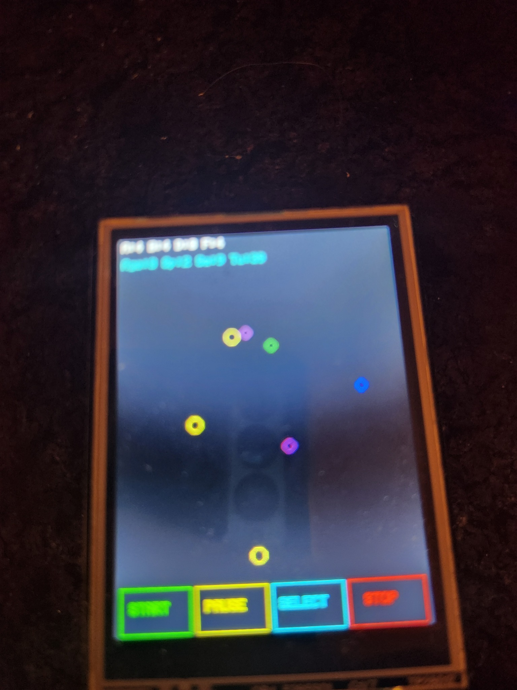
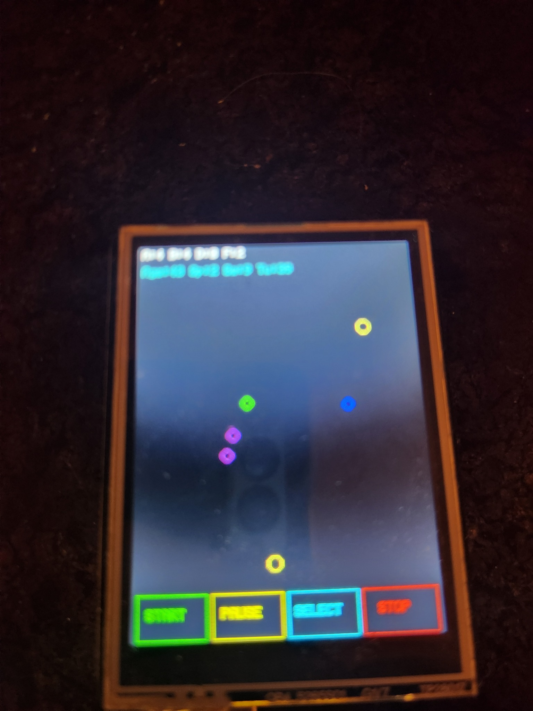
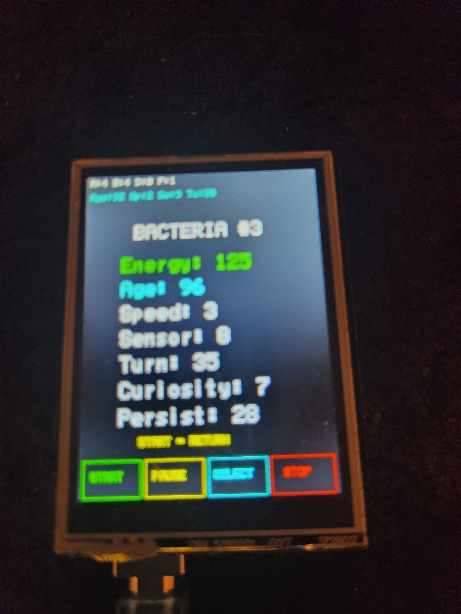
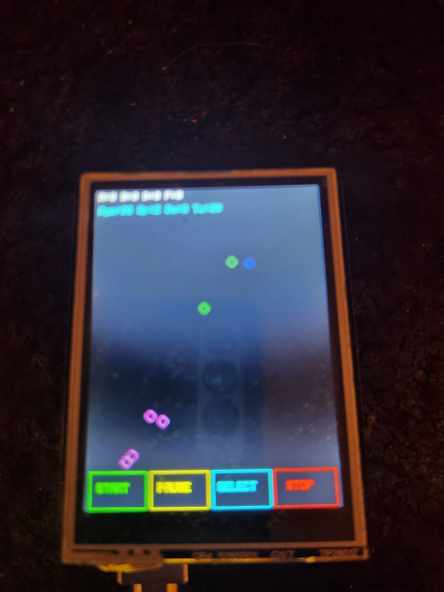

# Arduino Bacteria Lab


Модель искусственной жизни для **Arduino Uno** и **Seeed Studio 2.8" TFT Touch Shield v2.0**.

Бактерии ищут пищу с помощью упрощённого хемотаксиса, расходуют энергию, стареют, размножаются, наследуют гены с мутациями и умирают. Погибшая бактерия оставляет источник пищи. Сенсорный экран позволяет запускать, приостанавливать и останавливать симуляцию, а также выбирать отдельную бактерию и просматривать её параметры.

## Возможности версии v0.2.0

- хемотаксис и поиск пищи;
- энергия, старение и смерть;
- размножение, наследование и мутации;
- превращение погибшей бактерии в пищу;
- статистика популяции;
- сенсорные кнопки `START`, `PAUSE`, `SELECT`, `STOP`;
- просмотр параметров выбранной бактерии;
- разные цвета бактерий в зависимости от гена скорости.

## Оборудование

- Arduino Uno;
- Seeed Studio 2.8" TFT Touch Shield v2.0;
- USB-кабель.

## Библиотека

Используется библиотека `TFT_Touch_Shield_v2.0`.

Не устанавливайте одновременно отдельную библиотеку `Touch_Screen_Driver`: она содержит дублирующиеся файлы `SeeedTouchScreen.cpp` и `SeeedTouchScreen.h` и может вызвать ошибку `multiple definition`.

## Запуск

1. Установите TFT Shield на Arduino Uno.
2. Откройте `BacteriaLab_v1_5_Select/BacteriaLab_v1_5_Select.ino`.
3. Выберите `Инструменты → Плата → Arduino Uno`.
4. Выберите правильный COM-порт.
5. Нажмите `Загрузить`.

## Управление

| Кнопка | Назначение |
|---|---|
| `START` | Запуск новой симуляции или возврат с экрана параметров |
| `PAUSE` | Пауза |
| `SELECT` | Переход в режим выбора бактерии |
| `STOP` | Остановка симуляции |

После нажатия `SELECT` коснитесь бактерии. Откроется экран её параметров. Для возврата нажмите `START`.

## Расшифровка цветов

### Бактерии

Цвет бактерии определяется геном скорости:

| Цвет | Значение |
|---|---|
| Синий | `Speed = 1`, медленная бактерия |
| Зелёный | `Speed = 2`, средняя скорость |
| Фиолетовый | `Speed = 3`, быстрая бактерия |

### Объекты и интерфейс

| Цвет | Значение |
|---|---|
| Жёлтый круг | Источник пищи |
| Белая строка сверху | Основная статистика популяции |
| Голубая строка сверху | Средние показатели генов и возраста |
| Зелёный | `START`, энергия выбранной бактерии |
| Жёлтый | `PAUSE`, подсказка возврата |
| Голубой | `SELECT`, возраст выбранной бактерии |
| Красный | `STOP`, предупреждения и сообщения об остановке |

## Статистика на главном экране

Первая строка:

| Показатель | Значение |
|---|---|
| `A` | Alive — число живых бактерий |
| `B` | Born — сколько бактерий родилось всего, включая стартовую популяцию |
| `D` | Dead — сколько бактерий погибло |
| `F` | Food — число активных источников пищи |

Вторая строка:

| Показатель | Значение |
|---|---|
| `Age` | Средний возраст живых бактерий |
| `Sp` | Среднее значение гена скорости |
| `Se` | Среднее значение гена сенсора |
| `Tu` | Среднее значение гена поворота |

## Параметры выбранной бактерии

| Показатель | Значение |
|---|---|
| `BACTERIA #` | Номер бактерии во внутреннем массиве программы |
| `Energy` | Текущий запас энергии |
| `Age` | Возраст бактерии |
| `Speed` | Ген скорости движения |
| `Sensor` | Дальность сенсора пищи |
| `Turn` | Сила изменения направления |
| `Curiosity` | Вероятность исследовательского поворота |
| `Persist` | Устойчивость движения при ухудшении запаха пищи |

`START = RETURN` означает, что кнопка `START` возвращает на главный экран без полного сброса текущего мира.

## Скриншоты

### Главный экран



### Работающая популяция



### Просмотр отдельной бактерии



### Другое состояние популяции



## Видео

Полная короткая демонстрация находится в файле:

`media/bacteria_lab_v0_2_demo.mp4`

## Структура проекта

```text
Arduino-Bacteria-Lab/
├── BacteriaLab_v1_1/
│   └── BacteriaLab_v1_1.ino
├── BacteriaLab_v1_5_Select/
│   └── BacteriaLab_v1_5_Select.ino
├── screenshots/
│   ├── 01_main_simulation.jpg
│   ├── 02_running_population.jpg
│   ├── 03_bacteria_info.jpg
│   └── 04_population_state.jpg
├── media/
│   ├── bacteria_lab_v0_2_demo.gif
│   └── bacteria_lab_v0_2_demo.mp4
├── CHANGELOG.md
├── LICENSE
└── README.md
```

## Ограничения

Это экспериментальная модель искусственной жизни, а не точная биологическая симуляция. Arduino Uno имеет ограниченный объём оперативной памяти и вычислительную производительность, поэтому число бактерий и сложность поведения ограничены.

## Планы

- идентификаторы бактерий и поколения;
- родословная и `Parent ID`;
- дополнительные механизмы эволюции;
- перенос расширенной версии на ESP32;
- аппаратная реализация отдельных процессов на FPGA.

## Версия

`v0.2.0`

## Лицензия

MIT License.
