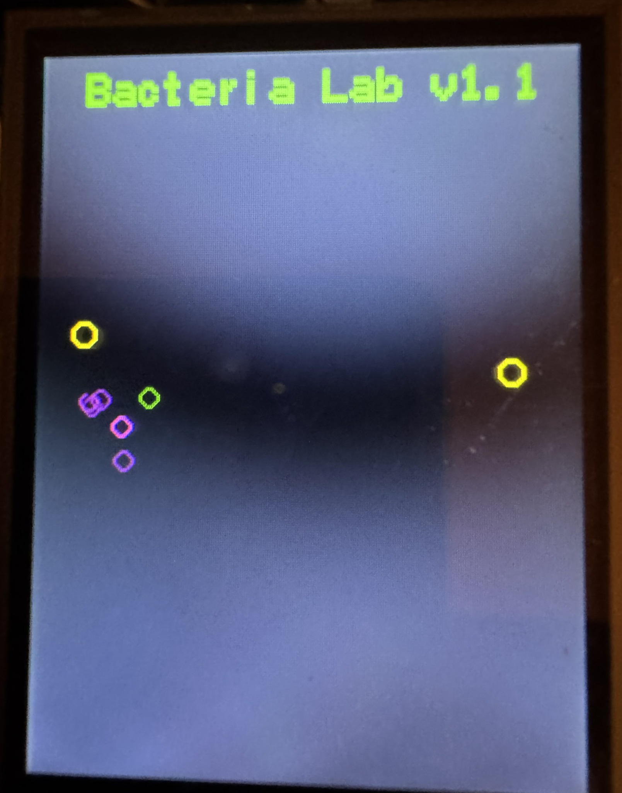
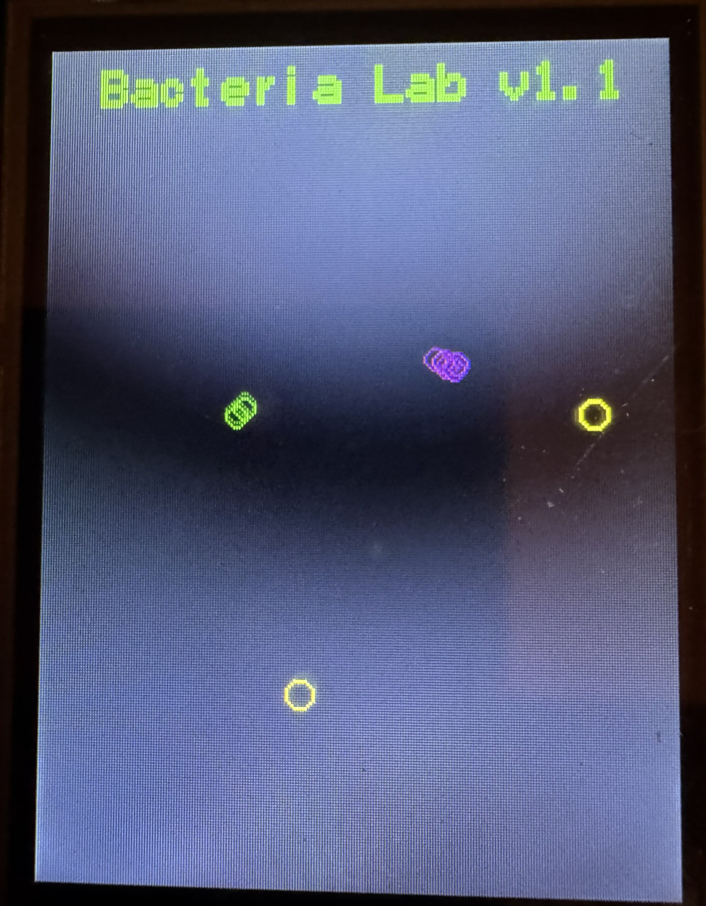
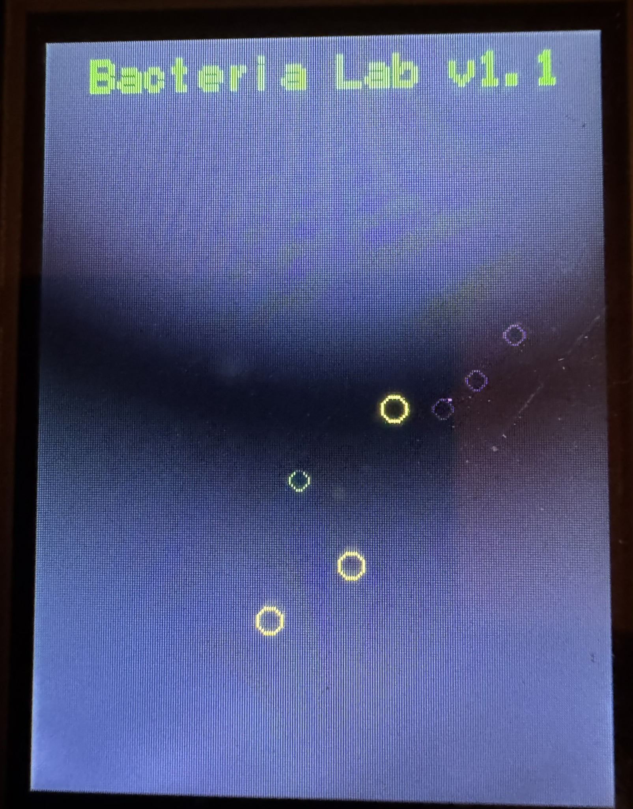
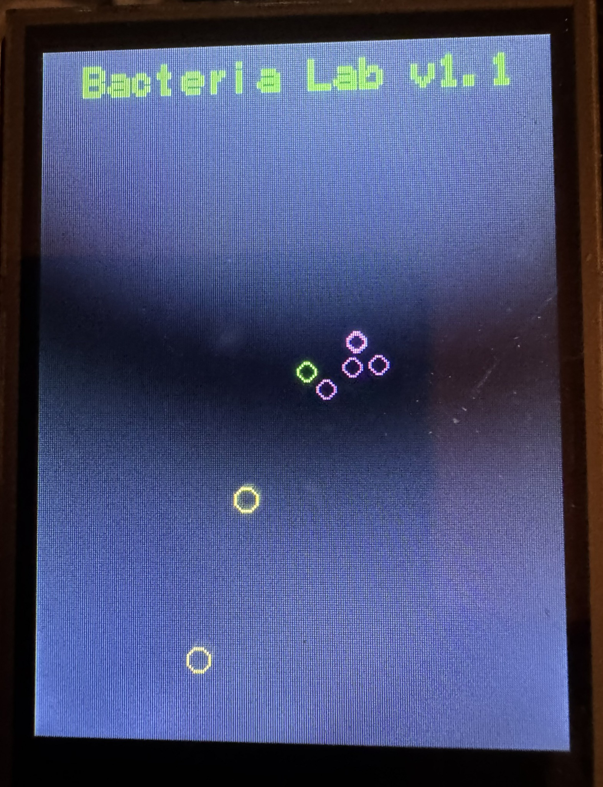

# Arduino Bacteria Lab

Модель искусственной жизни для Arduino Uno и Seeed Studio 2.8" TFT Touch Shield v2.0.
Модель искусственной жизни для **Arduino Uno** и
**Seeed Studio 2.8" TFT Touch Shield v2.0**.

Бактерии ищут пищу с помощью упрощённого хемотаксиса, используют
короткую память запаха, расходуют энергию, размножаются, наследуют
гены с мутациями, стареют и умирают.

## Оборудование

- Arduino Uno
- Seeed Studio 2.8" TFT Touch Shield v2.0
- USB-кабель

## Библиотека

Используется `TFT_Touch_Shield_v2.0`.

Не устанавливайте одновременно отдельную библиотеку
`Touch_Screen_Driver`: она содержит дублирующиеся файлы
`SeeedTouchScreen.cpp` и `SeeedTouchScreen.h` и может вызвать ошибку
`multiple definition`.

## Запуск

1. Установите TFT Shield на Arduino Uno.
2. Откройте `BacteriaLab_v1_1/BacteriaLab_v1_1.ino`.
3. Выберите `Инструменты → Плата → Arduino Uno`.
4. Выберите правильный COM-порт.
5. Нажмите «Загрузить».

## Цвета

- синий — скорость 1;
- зелёный — скорость 2;
- фиолетовый — скорость 3.

## Гены

- `speed` — скорость;
- `sensor` — дальность сенсора;
- `turnGene` — сила поворота;
- `curiosity` — вероятность исследовательского поворота;
- `persistence` — устойчивость к ухудшению запаха.

## Фото

Сохраните фотографию работающего устройства под именем:

`screenshots/bacteria_lab.jpg`

README уже настроен на показ этого изображения.

## Ограничения

Это экспериментальная упрощённая модель искусственной жизни,
а не точная биологическая симуляция.

## Версия

`v0.1.0`

## Лицензия

MIT License.

## Галерея

